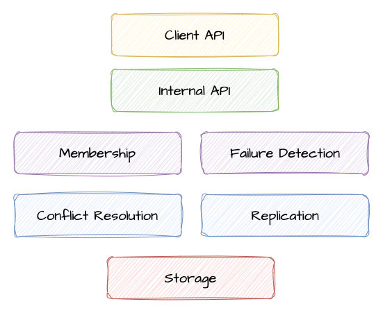

<div align="center"> 
   
   <p>Distributed key-value database for educational purposes</p>
   
   
</div>

---

Kivi falls into the category of Dynamo-style databases (like Cassandra and Riak), 
which are distributed databases that were initially designed for high availability
and partition tolerance. The primary difference between Kivi and other databases 
in this category is its simplicity, offering an easily understood and modifiable 
implementation of core distributed system concepts.

The main goal of this project is to provide myself and others with hands-on 
experience in databases, distributed systems, and their underlying mechanics. 
Although the project is still in its early stages, it is already possible to run 
a fully functional cluster of nodes and perform basic operations such as gets, 
puts, and deletes.

## Key Properties

 * **Handcrafted**: The core functions should not rely on any external libraries.
 * **Leaderless**: The system should not have a single point of failure.
 * **Highly Available**: The system should be available even if some nodes fail.
 * **Replicated**: The system should replicate data across multiple nodes.
 * **Eventually Consistent**: The system should eventually converge to a consistent state.
 * **Partition Tolerant**: The system should be able to tolerate network partitions.
 * **Configurable**: The system should allow to configure the consistency level for reads and writes.
 * **Conflict Resilient**: The system should be able to resolve conflicts in case of concurrent updates.
 * **Simple API**: The system should provide a simple API for storing and retrieving key-value pairs.
 * **Simple Deployment**: The system should be easy to configure and deploy.
 * **Simple Implementation**: The system should be easy to understand and modify.
 * **High Performance**: The system should be able to handle a large number of requests per second.

## The Building Blocks

<p align="center">
  
</p>

### Membership and Failure Detection

The membership layer is responsible for maintaining the list of nodes in the
cluster and detecting failures. It uses a SWIM-like gossip protocol to exchange
information about cluster members and their status.

On each algorithm iteration, a node randomly selects other node from the cluster
and sends it an empty **ping** message. The receiving node responds with a 
**ping-ack** message containing a hash of its membership list. The sending node 
then compares the hash with its own membership list and initiates 
a **state-exchange** operation in case of a mismatch.

During the **state-exchange**, the sending node sends its membership list to the
receiving node, which then merges it with its own list and sends back a new list
of members. The sending node then merges the received list with its own and
updates its membership list accordingly.

In case the **ping** request fails, the sending node asks two other random nodes
from the cluster to ping the failed node on its behalf. If the node is still
unresponsive, the sending node marks the receiving node as unhealthy. This
state will be propagated to other nodes in the cluster during the next algorithm
iteration.

### Persistent Storage

The storage layer is responsible for storing the key-value pairs on disk. The 
storage is based on log-structured merge trees (**LSM-Tree**), which are a type 
of external memory data structure allowing for efficient writes and providing 
decent read performance. LSM-tree is composed of two main components: the in-memory 
sorted map (**memtable**) and the on-disk sorted string tables (**SSTables**).

The memtable holds the most recent updates to the database. Each write to a 
memtable is added to a **write-ahead log** which is used to restore the contents 
of the memtable in case of a crash or restart. Once the size of the memtable 
exceeds a certain threshold, it is flushed to disk as an immutable **SSTable**
accompanied by a **sparse index** and a **bloom filter** files. SStables are 
stored in level-based structure, where each level contains a set of SSTables.

```
$ tree data
├── STATE
├── mem-1679761553589453.wal
├── sst-1679520869189745.L0.bloom
├── sst-1679520869189745.L0.data
├── sst-1679520869189745.L0.index
├── sst-1679594643164184.L0.bloom
├── sst-1679594643164184.L0.data
├── sst-1679594643164184.L0.index
├── sst-1679595355518826.L1.bloom
├── sst-1679595355518826.L1.data
└── sst-1679595355518826.L1.index
```

A background **compaction process** periodically merges the SSTables in each 
level into larger SSTables and moves them to the next level, removing the values
that were overwritten by newer updates. Each change to the tree state is recorded 
in the `STATE` file, which is used to restore the last known state of the tree
and to identify the files that were merged and thus can be safely deleted during 
the **garbage collection process**.

The reads are performed by first checking the memtable, and then the SSTables
from newest to oldest. The SSTables are searched using the **bloom filter** to
quickly skip the files that do not contain the requested key. The **sparse
index** is then used to find the approximate location of the key in the data file,
and from there the data file is scanned linearly to find the exact location of
the key.

### Replication and Consistency

The replication layer is responsible for coordinating reads and writes to
multiple nodes. It uses a quorum-based approach to ensure that the desired
consistency level is achieved. The replication layer is also responsible for
detecting and resolving conflicts in case of concurrent updates of the same key
from different clients on different nodes.

Once a read or write request is received, the replication layer mirrors it to all
available nodes in the cluster. The request is considered successful if the desired
number of nodes acknowledge it. The number of nodes depends on the configured 
consistency level. For example, if the write consistency level is set to `Quorum`, 
the majority of nodes (2/3 or 3/5) must confirm that the write operation was 
successful.

Since the writes can be performed on any node in the cluster, it is possible that 
the same key may be updated on multiple nodes. A conflict occurs when two or more
nodes have different values for the same key. The conflict resolution strategy 
relies on **version vectors** to determine the causal order of updates. In case 
there is a clear dependency that one update happened before the other, the update 
with the lower version is discarded. In case there is no clear relationship between 
the updates, the server returns a list of all conflicting values and leaves it up
to the client. The client can then choose to perform conflict resolution using
a different content-aware strategy, such as last-write-wins or use conflict-free 
data structures (CRDT).

## Running a Local Cluster

The `docker-compose.yaml` contains a minimal configuration of a cluster of
five replicas. To run it, use:

 1. `make image`
 2. `docker compose up`

With the default consistency level, you need the majority of nodes (3 out of 5)
to be available to perform reads and writes. A failure can be simulated by
killing one or two of the containers with `docker kill`.

## Client API

The REST API is available at `localhost:8001-8003`. It is a simple wrapper around
the internal GRPC API, allowing to perform reads and writes via HTTP requests and
check the health of the cluster. Due to limitations of JSON format, the keys and
values can only be represented as strings.

The following endpoints are available:

### `GET /kv/{key}`

*Getting the value of a key in the database.*

<details>
<summary><strong>Response - No value</strong></summary>

```
HTTP/1.1 200 OK

{
   "Found": false,
   "Version": ""
}
```
</details>

<details>
<summary><strong>Response - Single value</strong></summary>


```
HTTP/1.1 200 OK
Content-Type: application/json

{
  "Found": true,
  "Value": "bar",
  "Version": "CgQIARADCgQIAhABCgQIAxAC"
}
```
</details>

<details>
<summary><strong>Response - Conflicting values</strong></summary>


```
HTTP/1.1 300 Multiple Choices
Content-Type: application/json

{
  "Values": [
    "bar1", 
    "bar2", 
    "bar3"
  ],
  "Found": true,
  "Version": "CgQIARADCgQIAhABCgQIAxAC"
}
```
</details>

### `PUT /kv/{key}`

*Updating or inserting a new value into the database. In case of updating an
existing value, the version of the previous value must be provided. The 
response will contain the updated version of a value.*

<details>
<summary><strong>Request - Inserting a new key</strong></summary>

```
PUT /kv/foo
Content-Type: application/json

{
   "Value": "bar"
}
```
</details>

<details>
<summary><strong>Request - Updating an existing key</strong></summary>

```
PUT /kv/foo
Content-Type: application/json

{
   "Value": "bar2"
   "Version": "CgQIAxAB"
}
```
</details>

<details>
<summary><strong>Response</strong></summary>

```
HTTP/1.1 200 OK
Content-Type: application/json

{
  "Version": "CgQIAxAB"
}
```
</details>

### `DELETE /kv/{key}`

*Deleting a key from the database. The version of the current value must be
provided. In case there is a concurrent update, only the versions that are bellow
the provided version will be deleted. Since delete is basically inserting a new
empty value, the version is updated and returned in the response.*

<details>
<summary><strong>Request</strong></summary>

```
DELETE /kv/foo
Content-Type: application/json

{
   "Version": "CgQIAxAB"
}
```
</details>

<details>
<summary><strong>Response</strong></summary>

```
HTTP/1.1 200 OK
Content-Type: application/json

{
  "Version": "CgQIAxAC"
}
```
</details>

### `GET /nodes`

*Getting the list of nodes in the cluster and their status.*

<details>
<summary><strong>Response</strong></summary>

```
HTTP/1.1 200 OK
Content-Type: application/json

{
  "Nodes": [
    {
      "ID": 1,
      "Name: "node1",
      "Addr": "172.24.2.1:3000",
      "Status": "left"
    },
    {
      "ID": 2,
      "Name: "node2",
      "Addr": "172.24.2.2:3000",
      "Status": "healthy"
    }
  ]
}
```
</details>

## References

The following resources, papers and books were the main source of inspiration for
this project:

 * [SWIM: Scalable Weakly-consistent Infection-style Process Group Membership Protocol](https://www.cs.cornell.edu/projects/Quicksilver/public_pdfs/SWIM.pdf)
 * [Dynamo: Amazon's Highly Available Key-value Store](https://www.allthingsdistributed.com/files/amazon-dynamo-sosp2007.pdf)
 * [Introduction to Reliable and Secure Distributed Programming](https://www.distributedprogramming.net)
 * [Distributed Computing: Principles, Algorithms, and Systems](https://www.cs.uic.edu/~ajayk/DCS-Book)
 * [The Art of Multiprocessor Programming](https://www.amazon.com/Art-Multiprocessor-Programming-Maurice-Herlihy-ebook/dp/B08HQ7XNLD)
 * [Designing Data-Intensive Applications](https://dataintensive.net/)
 * [MIT 6.824: Distributed Systems](https://pdos.csail.mit.edu/6.824/)
 * [Project Voldemort](https://www.project-voldemort.com/voldemort/)
 